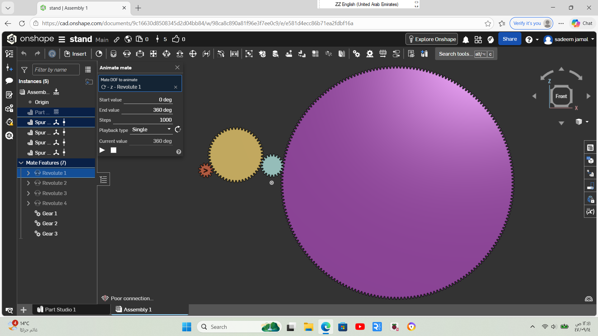

## I letter Design

### Design Preview

________

## (ســـ) Design

•	Created a center-point circle and applied an extrude (depth = 20 mm).
	•	Added a helix, and since the bracelet has one loop, set Target Revolution = 1.
	•	Created a square at the start of the loop and defined its width and depth.
	•	Opened a new sketch and performed a sweep using the square profile and helix path.
	•	Added fillets to both the lower and upper edges.
	•	Created a plane and drew a spline to form the S-shaped teeth, then applied a suitable depth.
	•	Used a Boolean operation to merge all parts.
	•	Changed the color to gold to match my bracelet.

### Design Preview

Difficulty defining the S-shaped teeth and controlling the dimensions.
The process was complex and time-consuming.
Understanding and setting the plane correctly took a long time.

______
## (Gear) Design

•	From Add Custom Features, selected Spur Gear and set:

•	Number of teeth = 50

•	Tooth depth = 9.7

•	Diameter = 77.7

•	Center bore = 7.1

•	Created a circle on the gear with a diameter of 77.7 to cover the extra part from the spur gear.

•	Applied an extrude with a depth of 27.

•	Added fillets to each gear tooth.

•	Added a 1 mm fillet to the lower circular edge.

•	Created a bottom circle with a diameter of 17.8.

•	Added 6 holes around it:

•	Distance from the inner circle edge = 3.2

•	Hole diameter = 3.2

•   ⁠Between each two small circles is an area of ​​13.7

•   ⁠Changed the color to purple.

### Design Preview

______
## (Servo holder) Design

- On the Top Plane, a rectangle with dimensions (40.3 × 27.1) was created.
- The sketch was extruded in two directions (right and left) by 10.5.
- Front and back ledges were added using:
  - The same cover length
  - A width of 7.168
- A center connection was added for measurement reference only.
- On each ledge:
  - Two holes with a diameter of Ø 4.25 were created.
  - Each hole was positioned 4.3 mm away from the center connection.
- Bottom ledges were added with:
  - A width of 7.566
  - The same cover length
  - A fillet applied to smooth the edges.
- A new sketch was created to add two holes identical to the top holes.
- The cover color was changed to grass green.
- After completing the model, servo fitting constraints were reviewed:
  - Top screw locations
  - Bottom charger clearance
- A full rectangular section was removed to provide sufficient space for the charger.

## Design Preview

______
# Task Week2

## (Base) Printing Specification

- 100*120 length and width
- Bottom hollowing applied with a **0.7 ratio**
- Hollowing created using the **Shell** tool
- Carving applied from the underside only
- Add Two TT-Motors , two wheels and 4 TT-motor bracket
  
## Printing Setup
- Printer: AnkerMake M5C
- Nozzle: 0.4 mm
- Filament: PLA+ we dont need strong material we want it to be more flexible.
- Layer Height: 0.1 mm
- Wall loops: 4 mm
- Sparse infill desity: 10%
- Generate Support: Yes-12.75g

## Design Preview

_______
## Robot ARM

- Component Import: Inserted all essential parts into the assembly, including the base, arms (brazo, antebrazo), gears, and the gripper mechanism (garra, engranajes).
- Base Grounding: Established the primary reference point by applying a Fastened Mate to the base del brazo, ensuring the entire structure remains stable during movement.
- Joint Definition (Revolute Mates): Applied Revolute Mates to the main joints (shoulder, elbow, and wrist) to allow controlled rotational movement between the arm segments.
- Gripper Mechanism: Positioned the garra components and linked them to the engranajes (gears) to facilitate the opening and closing action.
- Gear Relation: Configured a Gear Relation between the two gears to ensure that rotating one drives the other in the opposite direction for a realistic gripping motion.
- Complex Motion (Cylindrical Mates): Utilized Cylindrical Mates for parts requiring both linear sliding and rotation, such as the tubito or internal shafts.
- Ancillary Parts Assembly: Used Fastened Mates to secure static components like the circuit, tapa circuito, and indicador de perilla to their respective positions.
- Motion Validation: Tested each part individually to ensure smooth degrees of freedom and verified that there are no mechanical interferences between the moving links.

### Design Preview

.png)
.png)

# Video here:

[.png)](robot%20arm%20mov.mp4)

_______
## Kinematics task

### Design Preview

______
## Suspension 

# Suspension Top ROD
Function:
Connects the suspension system from the top and allows controlled movement with strong fixation.

Design Steps:
 •   Sketch a circle to define the rod base, then Extrude it to the required length.
 
 •   Create a thicker top section to support the joint.
 
 •   Add a side hole using Extrude Remove for a circle.
 
 •   Apply Fillet to sharp edges for better strength and smoother shape.
 
 •   To make rod body connect with the nut I made a new sketch in the middle of the circle and drew a triangle on it, 
 which I glued to the top edge of the circle. Then I drew a helix and a sweep.

# Suspension Spring
Function:
Absorbs shocks and reduces vibration in the suspension system.

Design Steps:
 •   Sketch a circle representing the wire diameter.
 
 •   Create a Helix/Spiral with height (73) and number of turns (6).
 
 •   Use Sweep to sweep the circular profile along the helical path.
 
 •   Add top and bottom end rings to glued spring with nut and with base.

# Suspension NUT

Function:
Adjusts and locks the spring position on the rod.

Design Steps:
 •   Sketch a circular base and Extrude it to (9) thickness.

 •   Create a central hole.
 
 •   Add new sketch trangle (2*2*2).
 
 •   Cut the outer shape into a star  To create the star, I drew a circle with a center point 6 meters from the edges of the main circle. Then I drew two lines along the edges of the circle, connecting them to the end of the main circle. After that, I closed the shape with a midpoint line. Then I duplicated the shape with a circular pattern. Finally, I extruded and removed the shape.
 
 •   Apply small Fillets by new sketch and add trangle after that revolve to smooth the edges.
 
 •   Last step I made a triangle with dimensions (2*2*2) to secure the nut to the base, glued it to the circular object, and created a helix and sweep.

# Suspension Base

Function:
Provides bottom support and connects the suspension system to the chassis or arm.

Design Steps:
 •   Sketch a circle and Extrude it (3).
 
 •   Add a central vertical shaft (70) to guide the spring.
 
 •   Add a mounting hole aligned with the joint.
 
 •   Apply Fillets to reduce stress concentrations.

I assembled all the suspension components in the Assembly workspace.
I used proper mates to align the parts correctly and make sure the movement looks realistic.

# Video here:

________
## LAST TASKS

# First Quastion solve:

I designed a gear system consisting of four gears.
The first gear has 216 teeth, the second gear has 20 teeth, the third gear has 50 teeth, and the last gear has 12 teeth.

Each gear is meshed with the one next to it. When the largest gear (216 teeth) makes one complete rotation, the last gear (12 teeth) rotates 18 times. Therefore, the overall gear ratio of the system is 1:18.

The individual gear ratios between each pair are as follows:
	•	The first gear to the second gear RATIO: 10.8
	•	The second gear to the third gear RATIO: 0.4
	•	The third gear to the last gear RATIO: 4.166

By multiplying these ratios together, the total gear ratio equals 18, which explains how one full rotation of the first gear results in 18 rotations of the final gear.

# Video here:

# Second Quastion solve:

# I didnt include the video coz its too large. But this is my Onshape acc if you wanna to check out my work.
email: sadeemjamal058@gmail.com
pass: Sadeemjamal12345
